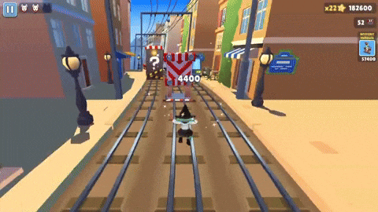

# How to locally develop the website

1. Build the game for the website:
  ```sh
  docker compose build --no-cache
  ```
  
2. Run website locally:
  ```sh
  docker compose up
  ```
  
3. Then, navigate to http://localhost:3000


